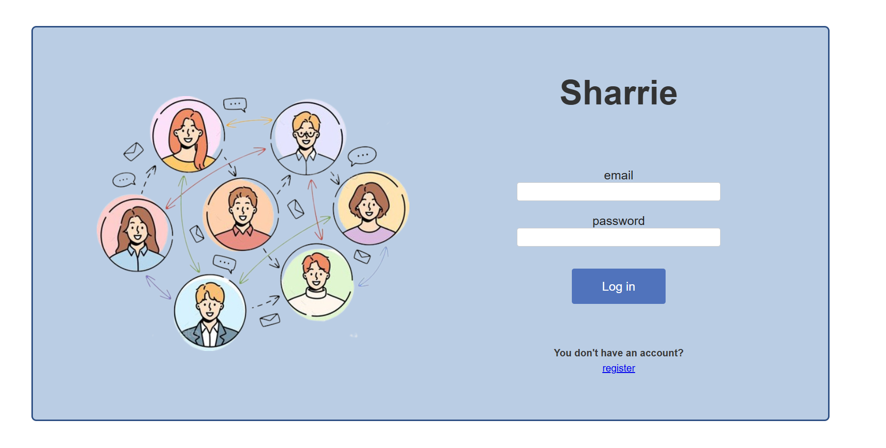
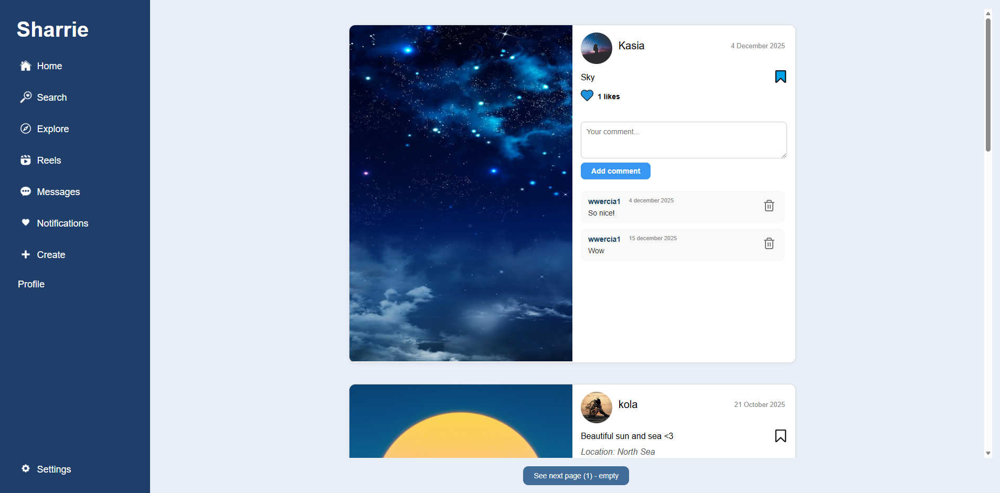
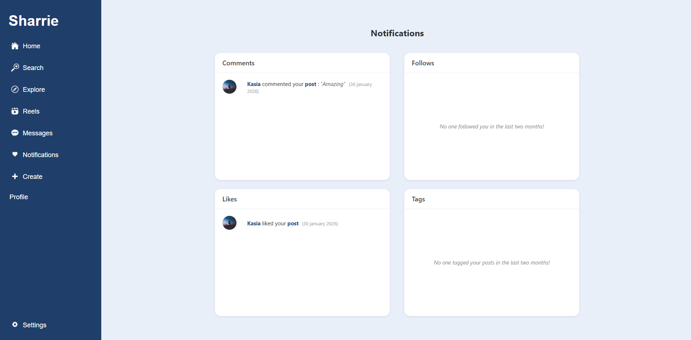
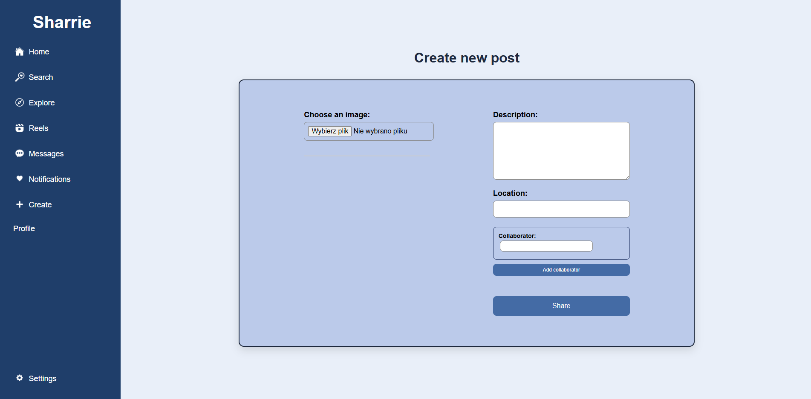
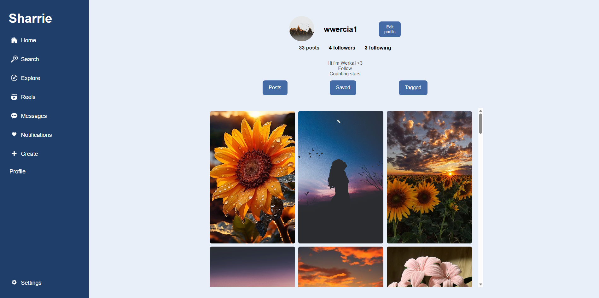
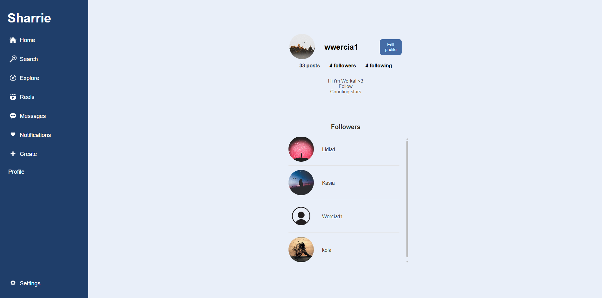
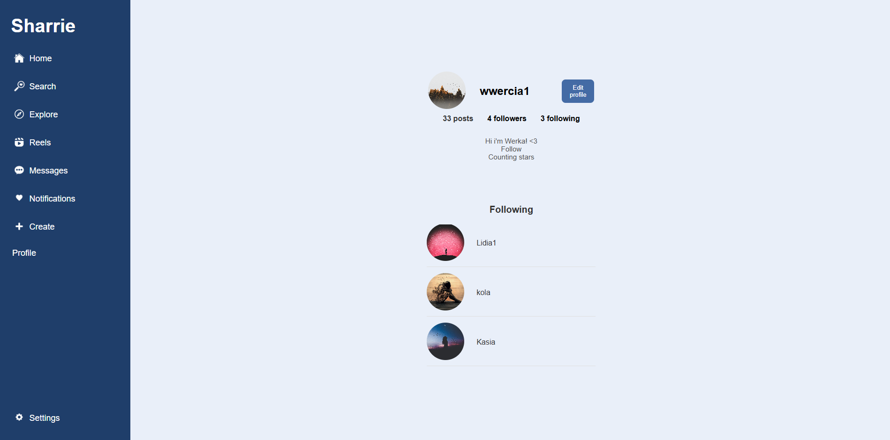
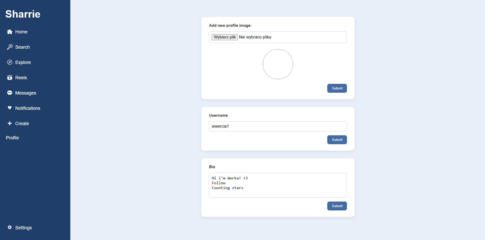

This project is currently in progress. 

# Sharrie

**Sharrie** is a social media web application inspired by popular photo-sharing platforms.   
It allows users to share photos, follow others, and interact through likes and comments.

## Login and Registration
Users can create a new account or log in.

## Home Page
After logging in, users can see posts from people they follow, with the newest posts displayed at the top.
Users can like, comment, and save posts, as well as quickly access the author's profile by clicking on their username.

## Notifications
The notifications page displays recent activity from the last two months, 
including likes, comments, new followers, and posts in which the user has been tagged.

## Create a Post
Users can upload an image, add a description, choose a location, and add collaborators to create a new post.

## Profile Page
The profile displays basic information such as the number of posts, followers, following, and the user's bio.

There are also three sections:
- your posts
- saved posts
- posts in which the user is tagged

Each section can be opened to browse the content.

## Followers List
Clicking the followers section opens a list of users who follow the account.

## Following List
Users can also view the list of users they follow.

## Edit Profile
Users can edit their bio, username, and avatar by clicking the "Edit Profile" button on the profile page.

## Features
- User registration and login
- Home page with posts from followed users
- Ability to like, comment, and save posts
- Notifications about recent activity
- Creating posts with images, descriptions, locations, and collaborators
- Tagged and saved posts sections
- Profile editing
- Logout functionality (Settings section)

### About this project
Backend-focused learning project with database integration and a simple web interface.